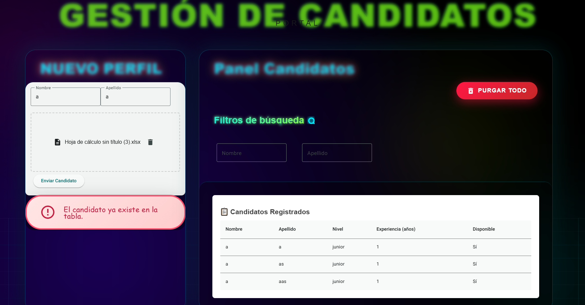

🚀 Mi Aplicación Fullstack (Gestión de Candidatos)

Este proyecto es un Monorepo basado en Nx para la gestión de candidatos, con frontend en Angular (Material UI), backend en Node.js y contenedores Docker para base de datos y servicios.

🛠 Tecnologías Principales

Frontend: Angular + Material UI (docs
)

Backend: Nest.js y Node.js

Monorepo Tool: Nx (docs
)

Lenguaje: TypeScript

Testing: Jest (docs
)

Contenedores: Docker / Docker Compose (docs
)

⚙ Configuración e Instalación
1. Requisitos Previos

Node.js (LTS 20.x recomendado)

npm o yarn

Nx CLI (opcional, pero recomendado): npm install -g nx

Docker y Docker Compose

2. Clonar el Repositorio

3. Instalar Dependencias
npm install
# o
yarn install

▶️ Arranque de Servicios
Opción 1: Desarrollo con Nx (hot-reload)

Ejecuta los servicios en terminales separadas:

Frontend (Angular + Material UI)

npx nx run frontend:serve

Backend (API)

npx nx run api:serve

Ideal para desarrollo. Si la API necesita base de datos, asegúrate de levantarla primero con Docker.

Opción 2: Levantar todo con Docker Compose
docker compose up -d

Levanta API, frontend y base de datos automáticamente.

Ideal para entorno de prueba o staging.

Para preview del frontend en navegador: http://localhost:4200 (configurable en docker-compose.yml).

🧪 Tests y Linting
Tarea	Comando
Ejecutar todos los tests	npx nx run-many --target=test
Ejecutar tests de la librería candidates	npx nx run feature-candidates:test
Ejecutar Linting (revisión de código)	npx nx lint
📂 Estructura del Código

apps/: Aplicaciones desplegables (api, frontend).

libs/: Librerías reutilizables:

Librería	Descripción
data-access	Servicios que interactúan con APIs
candidates-api	Tipos de datos e interfaces
feature-candidates	Componentes principales y lógica de negocio
ui-form-fields	Componentes UI reutilizables (Material UI)
🤝 Contribución (Git Flow)

Crear una rama nueva:

git checkout -b feature/nombre-de-la-tarea

Asegurarse de que los tests pasen.

Hacer commit y push de la rama.

Abrir un Pull Request (PR) para revisión.

Mantener el flujo Git Flow ayuda a controlar versiones y facilitar el CI/CD.

🔗 Links Útiles

Angular: https://angular.io/docs

Angular Material UI: https://material.angular.io/

Nx: https://nx.dev/

Docker: https://docs.docker.com/

Jest: https://jestjs.io/docs/getting-started

📝 Licencia

Este proyecto está bajo la Licencia [MIT].
